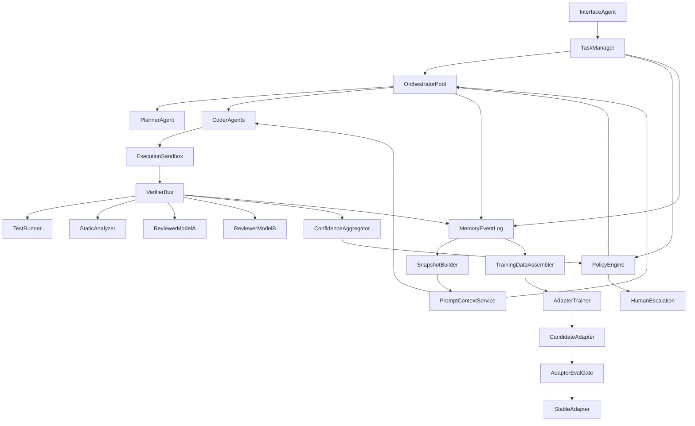
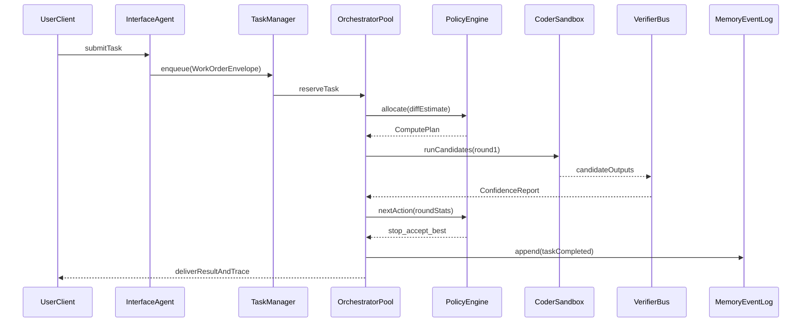
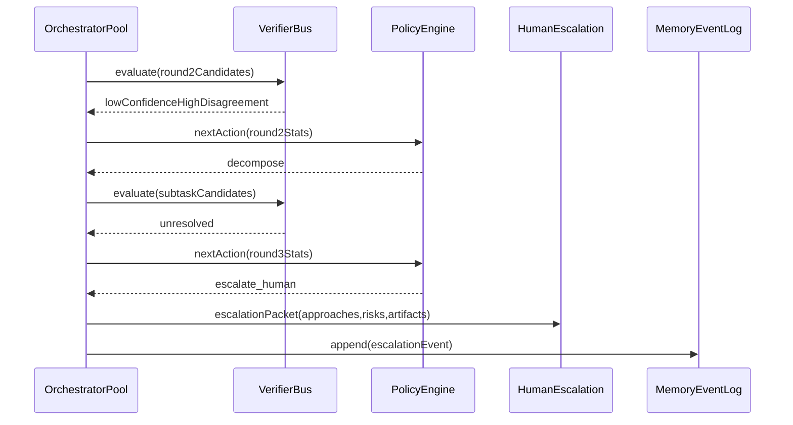

# Conductor Architecture Plan v3 (Aspirational)

## Status And Scope
Current state: proposed architecture for an unbuilt system.  
This document is a technical plan for implementation, not a claim of current capability.

## What This System Is
Conductor is a proposed local-first autonomous engineering system for dispatch-and-review workflows.  
It is designed to decompose work, execute with specialized agents in parallel, verify outputs with independent signals, and improve over time through a gated training loop.

## Design Principles
- Separate interface, orchestration, execution, and verification roles.
- Keep orchestration scalable and fault-tolerant (no single orchestrator bottleneck).
- Treat memory as append-only events plus deterministic snapshots.
- Use policy-driven compute budgets and explicit stop/escalation rules.
- Require offline eval gates before any adapter promotion to production.
- Polyglot-by-default: language is an implementation detail; stable interface contracts are the boundary.

## Polyglot Implementation Strategy

### Principle
Conductor is designed to behave like a distributed engineering org: **choose the language/toolchain that best fits the constraints of the component or task**, not a single “preferred language” for the whole system.

### Contract-First Boundaries (Non-Negotiable)
- **Interfaces are the source of truth**: components communicate via versioned contracts (HTTP+JSON/OpenAPI for Phase 0; optional gRPC/Protobuf later).
- **Replaceability**: any component can be rewritten in another language if it preserves the contract and emits the same required events/metrics.
- **Operational compatibility**: every component, regardless of language, must integrate with the same observability, tracing, and event log conventions.

### Language Selection Rubric (Examples)
- **Hot path / low-latency / memory-sensitive**: C/C++ or Rust.
- **High-concurrency network services** (gateway, queue, fanout): Go or Rust (Node can work in Phase 0 if latency budgets allow).
- **Orchestration logic / rapid iteration**: Python or TypeScript.
- **CLI tooling / glue**: Python, Node, or Go.

### Agent Behavior Implication
Sub-agents are allowed to propose and implement new system subcomponents (or refactors) in the language that best fits the requirement *if* they also provide:
- a build/test recipe,
- an integration plan with contracts,
- and migration/rollback notes.

## System Topology



## Core Components And Responsibilities

### TaskManager (New)
Intent: absorb ingress load and remove single Conductor bottleneck.  
Responsibilities:
- Queue, prioritize, and shard tasks by project/module.
- Route tasks to available orchestrator instances.
- Enforce global concurrency and SLA budgets.

### OrchestratorPool (Replaces single Conductor instance)
Intent: keep orchestration role pure while scaling horizontally.  
Responsibilities:
- Plan and decompose work orders.
- Dispatch scoped Coder tasks.
- Request policy decisions from `PolicyEngine`.
- Never execute filesystem writes or shell commands directly.

### PolicyEngine (New)
Intent: centralize convergence and budget decisions to stop retry thrash.  
Responsibilities:
- Determine tier allocation (`N`, max rounds, time budget).
- Trigger escalation/decomposition based on confidence and marginal gain.
- Apply stop conditions and fail-safe escalation rules.

### VerifierBus (New)
Intent: create independent verification lanes and calibrated confidence.  
Responsibilities:
- Run multi-source checks (tests, static analysis, heterogeneous reviewers).
- Normalize outputs to comparable signals.
- Produce calibrated confidence score and uncertainty reasons.

### MemoryEventLog + SnapshotBuilder (New memory contract)
Intent: deterministic, replayable memory state with strict ordering.  
Responsibilities:
- Append-only task, verification, decision, and outcome events.
- Build versioned snapshots for prompt assembly.
- Support per-task reproducibility and audit.

### AdapterEvalGate (New training safety layer)
Intent: prevent reward hacking and regression from entering production.  
Responsibilities:
- Evaluate candidate adapters against held-out regression suites.
- Compare candidate vs stable adapters on acceptance and error metrics.
- Promote only when pre-defined gates pass.

## End-To-End Runtime Flow

1. Interface receives a task and creates a normalized work order.
2. TaskManager queues work with priority, budget, and project constraints.
3. An orchestrator instance reserves the task and requests a compute plan from PolicyEngine.
4. Orchestrator requests prompt context from PromptContextService (built from memory snapshots).
5. Coder agents generate candidates in ExecutionSandbox with scoped filesystem permissions.
6. VerifierBus evaluates all candidates with tests, static analysis, and heterogeneous reviewers.
7. PolicyEngine decides next action: accept best, continue round, decompose, or escalate.
8. All decisions/results are appended to MemoryEventLog.
9. Task completes with artifact output + diagnostic summary for human review.
10. TrainingDataAssembler builds examples for candidate adapter training and gated promotion.

## Security And Trust Boundaries

### Boundary 1: Interface -> Orchestration
- Raw user input is sanitized and normalized by Interface Agent.
- Orchestrators consume structured work orders only.
- No direct command execution is allowed at this boundary.

### Boundary 2: Orchestration -> Execution
- Coder agents execute only inside scoped sandboxes.
- Permission grants are explicit, time-bounded, and task-scoped.
- Every permission grant and command result is logged as memory events.

### Boundary 3: Local-Only Default
- All inference and memory operations are local by default.
- External model/API escalation is opt-in, task-scoped, and auditable.

## Memory Architecture (Event-Sourced)

### Layers
- Layer A: Pinned constraints (non-compressible policy/config).
- Layer B: Recent high-fidelity working context.
- Layer C: Compressed historical summaries.
- Layer D: Annotated changelog and outcomes.
- Layer E: Structured project graph and metadata indices.

### Contract
- Source of truth is append-only `MemoryEventLog`.
- Snapshots are derived artifacts, rebuilt by deterministic reducers.
- Prompt assembly always references a snapshot ID for reproducibility.

### Consistency Rules
- Events are ordered by monotonic task clock.
- Cross-component writes are idempotent by `(taskId, eventKind, sequence)`.
- Snapshot builders reject missing dependency events and flag repair jobs.

## Policy-Driven Compute Allocation

### Tiering Model
- Tier 1: single sample + verification; low complexity.
- Tier 2: small ensemble + one retry round.
- Tier 3: larger ensemble + iterative refinement.
- Tier 4: decomposition-first or external escalation path.

### Hard Stop Rules
- Stop if marginal gain stays below threshold for consecutive rounds.
- Stop if wall-clock budget is exhausted.
- Escalate if confidence remains below threshold at max rounds.
- Force decomposition when divergence is persistently chaotic.

### Anti-Thrash Controls
- Minimum novelty requirement between rounds (must change approach class).
- Repeat-pattern detection from changelog history.
- Cooldown before retrial of previously failed strategy families.

## Verification Architecture

### Verifier Lanes
- Deterministic lane: tests, lint, static analysis, type checks.
- Model lane A: reviewer model with architecture/style rubric.
- Model lane B: heterogeneous reviewer (different model family or prompting strategy).
- Optional lane: differential testing, mutation tests, or fuzz checks.

### Aggregation
- ConfidenceAggregator computes weighted confidence, disagreement index, and uncertainty reasons.
- Automatic acceptance requires both confidence threshold and disagreement threshold.
- Any high-severity static/security failure blocks acceptance regardless of reviewer score.

## Model And Serving Strategy

### Proposed Serving Modes
- Phase-0 mode: single model service for all roles (simplest startup).
- Phase-1 mode: split services for orchestration and coding roles.
- Phase-2 mode: high-throughput coding fleet + separate orchestration brain.

### Practical Constraints
- Throughput and latency targets are hypotheses until measured.
- Prefix caching and continuous batching are optimization goals, not guarantees.
- Model routing remains provider-agnostic behind role-based interfaces.

## Training And Adaptation Plan

### Data Pipeline
- TrainingDataAssembler collects prompts, candidates, verification traces, and outcomes.
- Data quality filters remove malformed runs and low-confidence labels.
- Datasets are versioned per training cycle.

### Adapter Lanes
- `stable-prod`: currently promoted adapter.
- `candidate`: newly trained adapter under evaluation.

### Promotion Gates
- Candidate must beat stable on held-out regression suite.
- Candidate must not degrade verifier-calibrated acceptance metrics.
- Candidate must pass canary rollout before full promotion.

### Rollback Policy
- Any statistically meaningful production regression triggers automatic rollback to stable.
- Rollback event creates mandatory postmortem and dataset quarantine checks.

## Reliability And Operations

### Failure Domains
- Queue overload: handled by TaskManager backpressure and priority policy.
- Orchestrator failure: task re-reservation with heartbeat timeout.
- Sandbox failure: candidate marked invalid, retriable within policy budget.
- Memory reducer failure: snapshot freeze + replay repair job.

### Observability
- Per-task trace IDs across all components.
- SLO dashboards: queue wait, orchestration latency, verifier disagreement, escalation rate.
- Postmortem template linked to memory event replay for every failed task class.

## Deployment Phases And Readiness Gates

### Phase 0: Foundation
- Build interface, task queue, single orchestrator, sandbox execution, baseline verifier.
- Gate: deterministic end-to-end run on representative task suite.

### Phase 0.5: Control-Plane Hardening
- Add PolicyEngine, event-sourced memory, snapshot-based prompts, anti-thrash rules.
- Gate: replay determinism target met and retry overrun below threshold.

### Phase 1: Split-Brain Serving
- Separate orchestration and coder model services.
- Add heterogeneous reviewer lane and confidence calibration.
- Gate: verifier false-positive rate within target band on sampled tasks.

### Phase 2: Throughput And Training Loop
- Scale coder parallelism and enable candidate adapter cycles.
- Introduce canary adapter promotion with automated rollback.
- Gate: candidate beats stable without regression on held-out + canary metrics.

## Success Metrics (Proposed)
- Orchestration: p95 queue wait and orchestration latency.
- Quality: human acceptance rate and revision count per accepted task.
- Verification: false-positive/false-negative rates against human final judgment.
- Efficiency: wall-clock per completed task by tier.
- Reliability: task failure rate and replay determinism rate.

## Known Risks And Mitigations
- Correlated verifier/model blind spots -> add heterogeneous reviewer and deterministic checks.
- Retry loops consuming budget -> novelty constraints + hard stop policies.
- Memory drift/staleness -> event sourcing + snapshot reproducibility.
- Reward hacking in training -> gated promotion + held-out regression suite + canary.
- Operational complexity growth -> strict interfaces and phased rollout gates.

## Minimal Interfaces

### 1) TaskManager API
```ts
type WorkOrder = {
  taskId: string;
  projectId: string;
  summary: string;
  priority: "low" | "normal" | "high" | "urgent";
  requestedBy: string;
  constraintsRef: string[];
  maxWallClockSec?: number;
};

type QueueResult = { accepted: boolean; reason?: string; queuePos?: number };

interface TaskManager {
  enqueue(work: WorkOrder): Promise<QueueResult>;
  reserve(orchestratorId: string): Promise<WorkOrder | null>;
  complete(taskId: string, outcome: "success" | "escalated" | "failed"): Promise<void>;
}
```

### 2) Orchestrator <-> PolicyEngine
```ts
type DifficultyEstimate = {
  score: number; // 0.0 - 1.0
  rationale: string[];
  predictedTier: 1 | 2 | 3 | 4;
};

type ComputePlan = {
  tier: 1 | 2 | 3 | 4;
  sampleCount: number;
  maxRounds: number;
  maxWallClockSec: number;
  stopOnConfidence: number; // 0.0 - 1.0
};

type RoundStats = {
  round: number;
  passRate: number;
  confidence: number;
  marginalGain: number;
  divergenceClass: "converged" | "split" | "chaotic";
};

interface PolicyEngine {
  allocate(taskId: string, diff: DifficultyEstimate): Promise<ComputePlan>;
  nextAction(taskId: string, stats: RoundStats): Promise<"continue" | "decompose" | "escalate_human" | "stop_accept_best">;
}
```

### 3) VerifierBus
```ts
type CandidateResult = {
  candidateId: string;
  testsPass: boolean;
  testCoverageDelta?: number;
  staticIssues: number;
  reviewerScores: { source: "modelA" | "modelB"; score: number; notes: string[] }[];
};

type ConfidenceReport = {
  selectedCandidateId?: string;
  confidence: number;
  uncertaintyReasons: string[];
  disagreementIndex: number;
};

interface VerifierBus {
  evaluate(taskId: string, candidateIds: string[]): Promise<CandidateResult[]>;
  aggregate(taskId: string, results: CandidateResult[]): Promise<ConfidenceReport>;
}
```

### 4) Memory Event Log
```ts
type MemoryEvent =
  | { kind: "task_enqueued"; taskId: string; ts: string; payload: object }
  | { kind: "plan_allocated"; taskId: string; ts: string; payload: object }
  | { kind: "candidate_generated"; taskId: string; ts: string; payload: object }
  | { kind: "verification_completed"; taskId: string; ts: string; payload: object }
  | { kind: "policy_decision"; taskId: string; ts: string; payload: object }
  | { kind: "task_completed"; taskId: string; ts: string; payload: object };

interface MemoryEventLog {
  append(event: MemoryEvent): Promise<void>;
  snapshot(projectId: string, upToTs: string): Promise<{ snapshotId: string; data: object }>;
  replay(taskId: string): Promise<MemoryEvent[]>;
}
```

### 5) Adapter Promotion Gate
```ts
type AdapterMetrics = {
  passAt1: number;
  regressionFailureRate: number;
  reviewerDisagreement: number;
  humanAcceptRate: number;
};

interface AdapterEvalGate {
  evaluate(candidateAdapterId: string, stableAdapterId: string): Promise<AdapterMetrics>;
  promote(candidateAdapterId: string): Promise<boolean>;
}
```

## Operational Policies (Default v3 Targets)
- Stop if `marginalGain < 0.03` for two consecutive rounds.
- Escalate if `confidence < 0.65` after max rounds.
- Force decomposition when divergence remains `chaotic` after round 2.
- Reject automatic acceptance when heterogeneous reviewers disagree by more than `0.25`.
- Log every policy decision as a memory event for replay and postmortem.

## Validation Plan (Architecture-Level)

### A) Orchestration Scalability
- Metric: median queue wait and p95 orchestration latency.
- Success target: p95 wait < 10s at 5x baseline concurrency.

### B) Verification Independence
- Metric: verifier false-positive rate vs human final review.
- Success target: < 8% false positives on 200-task sample.

### C) Memory Determinism
- Metric: replay fidelity (`replay -> same decision trace`).
- Success target: > 99% deterministic replay on sampled tasks.

### D) Retry Thrash Control
- Metric: tasks exceeding max round budget.
- Success target: < 5% tasks exceed budget without escalation.

### E) Training Safety
- Metric: regression failure rate after adapter promotion.
- Success target: no statistically significant regression vs stable adapter.

## Implementation Backlog (Prioritized)
1. TaskManager queue + orchestrator heartbeats + task re-reservation.
2. PolicyEngine allocation and next-action APIs wired into orchestrator loop.
3. MemoryEventLog append contract and snapshot reducer service.
4. VerifierBus with deterministic lane + two reviewer lanes.
5. ConfidenceAggregator thresholds and automatic acceptance guardrails.
6. TrainingDataAssembler versioned dataset output and quality filters.
7. AdapterEvalGate with held-out test harness and canary rollout automation.

## Migration Notes (Legacy Draft -> v3)
1. Keep the prior v2 delta as the control-plane blueprint subset.
2. Add full lifecycle sections (security, memory contracts, ops, training safety).
3. Convert all performance values to targets/hypotheses pending empirical validation.
4. Enforce phase gates before introducing higher ensemble depth or training frequency.
5. Use this document as the canonical architecture plan for initial implementation.

## Detailed Appendix A: Non-Goals And Constraints

### Non-Goals (Initial Releases)
- Not a real-time IDE copilot replacement in initial phases.
- Not a fully autonomous merge-to-main system without human review.
- Not a cross-tenant multi-organization SaaS control plane.
- Not a guarantee of correctness; all confidence values are probabilistic.

### Hard Constraints
- Local-first default with explicit logging of any external inference calls.
- Task-scoped execution permissions only; no wildcard repository write grants.
- Replayability as a first-class requirement for all policy decisions.
- Rollback-first operational stance for any quality regression.

## Detailed Appendix B: Canonical Data Models

### Work Order Envelope
```ts
type WorkOrderEnvelope = {
  schemaVersion: "1.0";
  taskId: string;
  projectId: string;
  createdAt: string;
  createdBy: string;
  source: "obsidian" | "openwebui" | "api";
  intent: "feature" | "bugfix" | "refactor" | "tests" | "docs" | "research";
  summary: string;
  acceptanceCriteria: string[];
  constraintsRef: string[];
  repoScope: string[];
  budget: {
    maxWallClockSec: number;
    maxTokensHint?: number;
    escalationAllowed: boolean;
  };
  policyOverrides?: {
    minConfidence?: number;
    forceTier?: 1 | 2 | 3 | 4;
    noExternalCalls?: boolean;
  };
};
```

### Candidate Artifact Record
```ts
type CandidateArtifact = {
  candidateId: string;
  taskId: string;
  attemptRound: number;
  strategyClass: "baseline" | "alt_algorithm" | "error_handling_focus" | "performance_focus";
  modelRoute: string;
  patchSummary: string;
  filesTouched: string[];
  testInvocationIds: string[];
  staticInvocationIds: string[];
  generationMeta: {
    temperature: number;
    topP: number;
    promptSnapshotId: string;
  };
};
```

### Decision Trace Record
```ts
type DecisionTrace = {
  taskId: string;
  traceId: string;
  round: number;
  confidence: number;
  disagreementIndex: number;
  policyAction: "continue" | "decompose" | "escalate_human" | "stop_accept_best";
  rationaleCodes: string[];
  ts: string;
};
```

## Detailed Appendix C: Decision Policy Tables

### Confidence And Action Matrix
| Confidence | Disagreement | Policy default |
| --- | --- | --- |
| >= 0.85 | <= 0.15 | Accept best candidate if no hard failures |
| 0.70 - 0.84 | <= 0.25 | Run one targeted refinement round |
| 0.55 - 0.69 | <= 0.30 | Decompose or increase diversity |
| < 0.55 | any | Escalate to human or external route |

### Hard Failure Overrides
| Condition | Override |
| --- | --- |
| Critical static/security issue | Block acceptance |
| Test suite infra failure | Retry infra once, then mark indeterminate |
| Replay inconsistency detected | Freeze task progression and trigger repair |
| Sandbox policy violation | Immediate candidate rejection + alert |

### Marginal Gain Policy
- Define `marginalGain = currentConfidence - previousConfidence`.
- If marginal gain < `0.03` for 2 rounds and disagreement not improving, stop.
- If marginal gain >= `0.05`, allow one extra round even if prior stop condition reached.

## Detailed Appendix D: End-To-End Sequences

### Standard Success Path


### Divergence And Escalation Path


## Detailed Appendix E: Security Threat Model

### Threat Classes
- Prompt injection through user task content.
- Privilege creep in execution sandbox.
- Unsafe artifact write operations.
- Training data poisoning through malformed or adversarial tasks.
- Silent policy bypass due to component failure.

### Mitigation Controls
- Structured interface normalization with deny-list + schema validation.
- Capability tokens for sandbox operations with TTL and path allow-lists.
- Write-action preflight checks plus post-write verification hash.
- Dataset quality gate requiring provenance, schema validity, and confidence floor.
- Circuit breakers that fail closed on policy engine or verifier unavailability.

### Security Validation Checks
- Red-team prompt injection suite run weekly.
- Permission boundary tests on every CI run.
- Event log tamper-evidence checks (hash chain or signed segments).
- Incident drill for forced rollback and key rotation every quarter.

## Detailed Appendix F: Memory System Internals

### Event Taxonomy (Expanded)
- `task_ingested`
- `task_queued`
- `task_reserved`
- `plan_allocated`
- `context_snapshot_bound`
- `candidate_generated`
- `verification_started`
- `verification_completed`
- `policy_decision`
- `task_escalated`
- `task_completed`
- `adapter_candidate_promoted`
- `adapter_rollback`

### Snapshot Reducer Rules
- Reducers are pure functions over ordered event streams.
- Reducers are versioned; snapshot metadata stores reducer version.
- Schema migrations are forward-only; backfill jobs produce migration events.

### Repair Workflow
1. Detect broken dependency chain during snapshot build.
2. Mark snapshot invalid and freeze affected task IDs.
3. Replay events from last valid checkpoint with current reducer version.
4. Emit `snapshot_repaired` event and resume queue.

## Detailed Appendix G: Verification Scoring Design

### Proposed Confidence Formula
`confidence = 0.45 * tests + 0.15 * staticQuality + 0.25 * reviewerMean + 0.15 * convergence`

Where:
- `tests`: normalized pass ratio with failure severity penalties.
- `staticQuality`: inverse weighted static issue score.
- `reviewerMean`: calibrated mean of model lane scores.
- `convergence`: structural similarity confidence across passing candidates.

### Disagreement Index
- Calculated as weighted variance between reviewer lane outputs plus semantic distance between accepted candidate justifications.
- Used to gate automatic acceptance, not to choose candidate quality alone.

### Calibration Plan
- Weekly calibration against human-labeled outcomes.
- Store calibration curves per task category.
- Re-tune thresholds only after minimum sample size per category.

## Detailed Appendix H: Operational SLIs/SLOs

### Core SLIs
- Task queue latency (p50/p95).
- Time to first candidate.
- Time to verified candidate.
- Escalation rate by task category.
- Replay success rate.
- Adapter regression detection latency.

### SLO Targets (Initial)
- p95 queue latency: < 15s.
- p95 time to first candidate: < 90s on Tier 2 baseline workloads.
- Replay success: > 99%.
- Unplanned rollback frequency: < 1 per 100 tasks.

### Error Budget Policy
- If weekly SLO breaches exceed budget, pause feature work and prioritize reliability remediations.
- Any security boundary breach consumes full weekly error budget.

## Detailed Appendix I: Runbooks

### Runbook 1: Queue Saturation
1. Trigger: queue latency p95 above SLO for 10 minutes.
2. Action: reduce new task intake priority and cap Tier 3/Tier 4 task starts.
3. Action: enable degraded mode (`maxRounds=1`) for low-priority jobs.
4. Recovery: restore normal policy after 30-minute stable window.

### Runbook 2: Verifier Drift Spike
1. Trigger: false-positive rate exceeds threshold in rolling window.
2. Action: disable auto-accept and require human acceptance for all tasks.
3. Action: retrain calibration only; do not retrain main adapters yet.
4. Recovery: re-enable auto-accept after passing calibration check.

### Runbook 3: Adapter Regression
1. Trigger: candidate adapter canary underperforms stable adapter.
2. Action: automatic rollback and quarantine candidate dataset slice.
3. Action: postmortem to identify reward leakage or label noise.
4. Recovery: rerun training with filtered dataset and stricter gates.

## Detailed Appendix J: Testing Strategy

### Test Layers
- Unit tests: component-level logic for TaskManager, PolicyEngine, reducers.
- Integration tests: orchestrator loop with simulated verifier outputs.
- Replay tests: event log to snapshot determinism under versioned reducers.
- Chaos tests: injected failures in verifier lanes, sandbox, and queue.
- Security tests: permission boundary and injection resistance suites.

### Acceptance Test Corpus
- Curated benchmark of representative tasks by category and complexity.
- Includes golden traces for expected policy decisions.
- Used for phase gates and adapter promotion checks.

## Detailed Appendix K: Implementation Workstreams

### Workstream 1: Control Plane
- Deliverables: TaskManager, orchestration heartbeats, reservation protocol.
- Exit criteria: stable multi-orchestrator scheduling in load test.

### Workstream 2: Verification Plane
- Deliverables: VerifierBus, confidence scoring, disagreement gating.
- Exit criteria: calibrated verifier with measured false-positive ceiling.

### Workstream 3: Memory Plane
- Deliverables: event log, reducers, snapshot service, replay tools.
- Exit criteria: deterministic replay target met on benchmark corpus.

### Workstream 4: Training Plane
- Deliverables: data assembler, eval harness, candidate/stable adapter gate.
- Exit criteria: canary promotion pipeline with automatic rollback.

### Workstream 5: Ops And Reliability
- Deliverables: observability stack, SLO dashboards, runbook automation.
- Exit criteria: operational drills completed with acceptable MTTR.

## Detailed Appendix L: 12-Week Delivery Plan

### Weeks 1-2
- Implement WorkOrder envelope, queueing, reservation, and trace IDs.
- Build sandbox scaffolding with scoped execution tokens.

### Weeks 3-4
- Implement baseline orchestration loop and deterministic verifier lane.
- Add memory event append path for all major actions.

### Weeks 5-6
- Introduce PolicyEngine with default tiering and stop conditions.
- Add snapshot reducer and prompt binding by snapshot ID.

### Weeks 7-8
- Add heterogeneous reviewer lane and confidence aggregation.
- Start calibration dataset capture and replay regression corpus.

### Weeks 9-10
- Build training data assembler and candidate adapter eval harness.
- Implement canary rollout + rollback automations.

### Weeks 11-12
- Run full end-to-end phase gate validation.
- Produce launch readiness report with open risks and mitigations.

## Detailed Appendix M: Open Decisions

- Final weighting strategy for confidence aggregation per task category.
- Minimum sample size thresholds for calibration updates.
- External escalation policy and approval workflow defaults.
- Priority policy during mixed workloads and human review bottlenecks.
- Initial model routing map by role in constrained hardware mode.
